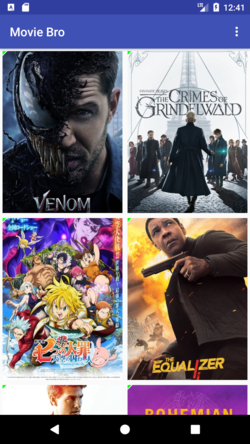
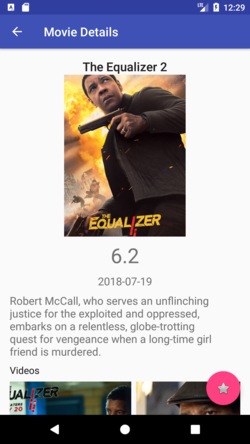
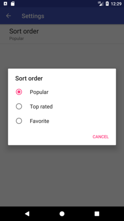

# Movie-Bro-App

- Fetch movies data throught network using **httpURLConnection**
- Preview data by using **Recycler view**
- Handled Images download and store by **Picasso** 
- Stored favorite moves on sqlite database using **ContentProvider**
- Use **Preference** to switch between different movies category

## Usage Library

- [Picasso](https://square.github.io/picasso/)
- [Butter Knife](http://jakewharton.github.io/butterknife/)

## Screenshots

     
